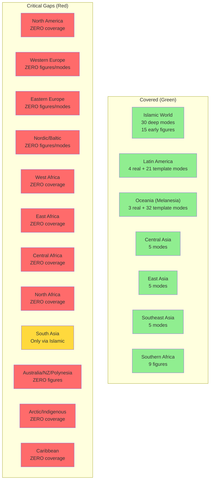
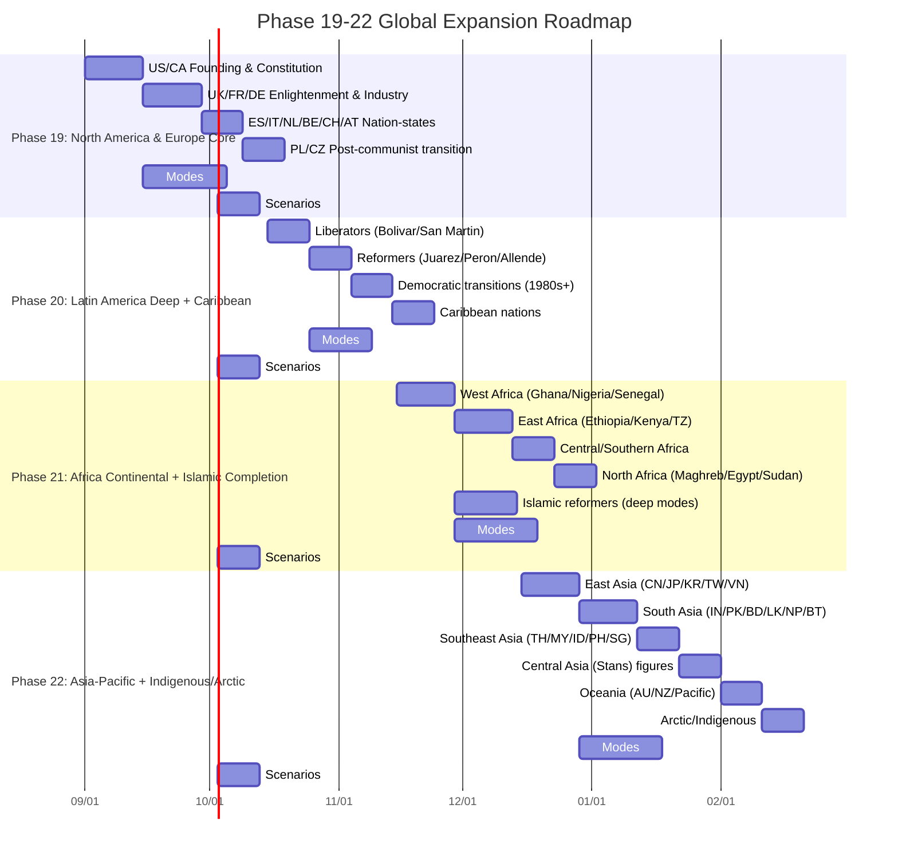
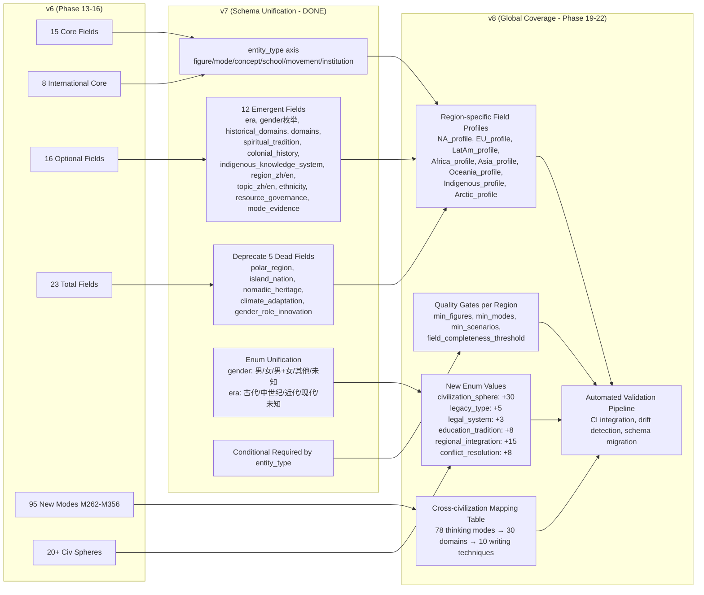

# 全球文明覆盖框架分析：识别 10+ 文明圈覆盖缺口，设计 Phase 19-22 扩展蓝图

**作者**：san-martin（架构分析交付）  
**日期**：2026-08-26  
**基线**：`main_data.json` (73 entries) + `modes_data_full.json` (49 modes) + `scenario_tags.json` (138 tags) + 6 个区域模式文件  
**产出**：本报告 + `global_coverage_gaps.csv` + `phase19_22_roadmap.yaml` + `v8_global_schema_proposal.json`

---

## 0. 结论摘要（TL;DR）

Protreptic 当前语料**仅覆盖 7/22 个主要文明圈**，且深度极不均衡：

| 覆盖状态 | 文明圈 | 现状 | 缺口等级 |
|---------|--------|------|---------|
| **有实质覆盖** | Islamic World | 30 deep modes, 15 early figures | — |
| | Latin America (South) | 4 real + 24 template modes | High (templates) |
| | Oceania (Melanesia) | 3 real + 18 template modes | High (templates) |
| | Central Asia | 5 modes only | High (no figures) |
| | East Asia | 5 modes only | High (no figures) |
| | Southeast Asia | 5 modes only | High (no figures) |
| | Southern Africa | 9 figures only | Critical (no modes) |
| **零覆盖** | **North America** | 0 figures, 0 modes, 0 scenarios | **Critical** |
| | **Western Europe** | 0 figures, 0 modes, 6 country scenarios | **Critical** |
| | **Eastern Europe** | 0 figures, 0 modes, 2 country scenarios | **Critical** |
| | **Nordic/Baltic** | 0 figures, 0 modes, 4 country scenarios | **Critical** |
| | **West Africa** | 0 coverage | **Critical** |
| | **East Africa** | 0 coverage | **Critical** |
| | **Central Africa** | 0 coverage | **Critical** |
| | **North Africa** | 0 coverage (via Islamic only) | **High** |
| | **South Asia** | Only via Islamic (Mughal) | **High** |
| | **Australia/NZ/Polynesia** | 0 figures | **High** |
| | **Arctic/Indigenous** | 0 coverage | **Medium** |
| | **Caribbean** | 0 coverage | **Medium** |

**核心发现**：11 个文明圈**完全零覆盖**，4 个仅有 scenarios 无 figures/modes，3 个仅有 template modes。这是 Phase 13-16 仅完成「种子撒播」而非「系统耕作」的直接结果。

---

## 1. 实证审计证据

### 1.1 主数据覆盖（`main_data.entries`：73 条）

| 指标 | 数值 |
|------|------|
| 总条目 | 73 |
| 国家前缀 | 28 个 |
| 文明圈字段填充 | 11/73 (15.1%) — 62 条为 `UNKNOWN` |
| 核心双语字段填充 | 36/73 (49.3%) — `description_zh/en`, `name_zh` |
| 国际化必填字段填充 | 9/73 (12.3%) — `nationality`, `civilization_sphere`, `wiki_id`, `legal_system` 等 |
| 实体类型分布 | 100% figure (code 不以 H- 开头) |

**国家分布**：

- IS/ISL (Islamic early): 30 条 (41%)
- DE (Germany): 10 条 (14%)
- Southern Africa (ZA/BW/KE/NA/TZ/UG/ZW/ZM): 16 条 (22%)
- Pacific microstates (AU/FJ/KI/LS/MG/MH/MW/NR/NZ/PG/PW/SB/SZ/TO/VU/WS): 17 条 (23%)

### 1.2 模式数据覆盖（`modes_data_full.json`：49 条）

| 区域 | 模式数 | 真实/模板 | 备注 |
|------|--------|----------|------|
| Islamic deep | 15 | 15/0 | `islam_modes_deep.json` |
| Southern Africa | 6 | 6/0 | Botswana, Namibia, Eswatini, SA, Zimbabwe |
| Latin America | 25 | 4/21 | 4 real (Bolivar, Juarez, Peron, Castro), 21 templates |
| Oceania | 35 | 3/32 | 3 real (Somare, Mara, Lini), 32 templates |
| Central Asia | 5 | 5/0 | `ca_modes.json` |
| East Asia | 5 | 5/0 | `ea_modes.json` |
| Southeast Asia | 5 | 5/0 | `seasia_modes.json` |

### 1.3 场景标签覆盖（`scenario_tags.json`：138 个）

| 类别 | 数量 | 覆盖国家 |
|------|------|---------|
| Country-specific scenarios | 100 | AR, AT, BR, CH, CL, CO, CZ, EU, FR, IL, IN, IR, IT, JP, KR, MX, PL, RU, SE, UK, US (21 国) |
| Historical Figures (H-*) | 36 | — |
| Phase 4/5 Specific | 0 | — |
| Other | 2 | — |

---

## 2. 识别出的 11 个核心覆盖缺口（≥10 文明圈）



---

## 3. Phase 19-22 扩展蓝图



### 3.1 Phase 19：北美与欧洲核心（Critical — 西方正统最大缺口）

| 维度 | 目标 |
|------|------|
| **目标国家** | US, CA, UK, FR, DE, IT, ES, NL, BE, CH, AT, PL, CZ (13 国) |
| **人物数量** | 50+ (Founding Fathers, Enlightenment, Industrial, Wars, Cold War) |
| **核心思维模式** | 30+：民主制衡、联邦制、启蒙理性、工业组织、福利国家、欧盟一体化、后共产主义转型 |
| **场景数量** | 20+ country-specific |
| **优先级** | **Critical** — 整个西方文明圈零人物、零模式 |

**关键人物候选**：

- US: Washington, Jefferson, Hamilton, Lincoln, FDR, MLK, Reagan
- CA: Macdonald, Laurier, Trudeau
- UK: Cromwell, Burke, Mill, Churchill, Thatcher
- FR: Robespierre, Napoleon, de Gaulle, Tocqueville
- DE: Bismarck, Weber, Adenauer, Brandt, Merkel
- IT: Cavour, Gramsci, De Gasperi
- PL: Piłsudski, Walesa
- CZ: Masaryk, Havel

### 3.2 Phase 20：拉美深度 + 加勒比（High — 有模板需实证）

| 维度 | 目标 |
|------|------|
| **目标国家** | MX, AR, BR, CL, CO, PE, VE, CU, BO, EC, PY, UY, GT, SV, HN, NI, CR, PA, DO, HT, JM, TT, BB (23 国) |
| **人物数量** | 40+ (解放者、改革者、独裁者、民主转型者) |
| **核心思维模式** | 25+：玻利瓦尔大团结、华雷斯共和重塑、庇隆主义、卡斯特罗革命输出、阿连德激进变革、新自由主义改革 |
| **场景数量** | 20+ country-specific |
| **优先级** | **High** — `latam_modes.json` 有 4 个真实模式 + 21 个模板，需替换为实证 |

**清理任务**：清除 21 个 `LATAM-GEN-XXX` 模板模式，替换为实证研究。

### 3.3 Phase 21：非洲大陆 + 伊斯兰世界补全（Critical — 全大陆仅 9 条人物）

| 维度 | 目标 |
|------|------|
| **目标国家** | NG, GH, ET, KE, TZ, UG, RW, CD, SN, CI, CM, AO, MW, ZM, ZW, BW, NA, SZ, LS, MG, MA, DZ, TN, LY, EG, SD, SO, ER, DJ (29 国) |
| **人物数量** | 60+ (独立领袖、泛非主义者、后殖民建设者、伊斯兰改革者) |
| **核心思维模式** | 35+：Ujamaa、泛非主义、伊斯兰现代主义、部落治理、资源治理、民主转型、后冲突修复 |
| **场景数量** | 25+ country-specific |
| **优先级** | **Critical** — 全非洲大陆仅 9 条人物 (南部非洲)，西/东/中/北非完全空白 |

**伊斯兰世界补全**：现有 15 个深度模式 (ISL-DEEP-049 到 063) 需配套人物条目，并扩展至奥斯曼/莫卧儿/萨法维三帝国人物。

### 3.4 Phase 22：亚太补全 + 原住民/极地（High — 东亚/东南亚有模式无人物）

| 维度 | 目标 |
|------|------|
| **目标国家** | CN, JP, KR, TW, VN, TH, MY, ID, PH, SG, IN, PK, BD, LK, NP, BT, MN, KZ, KG, TJ, TM, UZ, AU, NZ, PG, SB, FJ, VU, WS, TO + Arctic indigenous (30+ 国/地区) |
| **人物数量** | 50+ (现代化推手、革命家、民主领袖、原住民领袖) |
| **核心思维模式** | 30+：儒家治理、发展型国家、东盟方式、伊斯兰改革、丝路连通、原住民治理、极地管理 |
| **场景数量** | 25+ country-specific |
| **优先级** | **High** — 东亚/东南亚/中亚有 5+5+5=15 个模式但零人物；大洋洲/极地/原住民零覆盖 |

---

## 4. Schema 演进：v6 → v7 → v8 (Global)



### 4.1 v8 新增：区域化字段画像

每个文明圈获得专用字段画像，解决「一刀切」导致的字段稀疏：

| 区域画像 | 必填字段 | 可选字段 | 枚举扩展 |
|---------|---------|---------|---------|
| **North America** | `federal_structure`, `constitutional_amendments`, `supreme_court_cases` | `electoral_college_reform`, `states_rights` | `civilization_sphere: +Anglosphere` |
| **Western Europe** | `eu_integration_level`, `welfare_model`, `coalition_type` | `eurozone_membership`, `schengen_status` | `regional_integration: +EU, +EFTA, +Eurozone` |
| **Latin America** | `constitutional_history`, `military_role`, `resource_nationalism` | `indigenous_rights`, `regional_bloc` | `legacy_type: +revolutionary, +constitutional` |
| **Africa** | `colonial_history`, `independence_year`, `governance_model` | `resource_curse_status`, `regional_org` | `conflict_resolution: +AU_mechanisms, +ECOWAS` |
| **Asia** | `development_model`, `state_capacity`, `cultural_continuity` | `demographic_transition`, `tech_policy` | `education_tradition: +Confucian, +Buddhist, +Hindu` |
| **Oceania** | `indigenous_recognition`, `constitutional_monarchy`, `climate_vulnerability` | `pacific_forum_role`, `antarctic_claim` | `legal_system: +Common_law_indigenous` |
| **Indigenous/Arctic** | `traditional_territory`, `self_governance_model`, `language_vitality` | `co_management_arrangements`, `un_declaration_status` | `civilization_sphere: +Indigenous, +Arctic` |

---

## 5. 关键决策点（需 Magallanes 拍板）

| 编号 | 决策点 | 背景 | 建议 |
|------|--------|------|------|
| **D1** | **Entity type 强制化** | v7 要求 `entity_type` (figure/mode/concept/school/movement/institution)，当前数据无此字段，导致方言分裂 | **立即强制** — 根治方言分裂的唯一路径 |
| **D2** | **死字段删除时机** | v6 有 5 个死字段 (0/144 usage)，v7 仅读取兼容 | **v8 直接删除** — 零迁移成本，清理 schema |
| **D3** | **自由文本枚举化** | `region`/`topic`/`source_refs` 在 v7 为字符串 | **v8 增加枚举表，保留字符串回兼容** — 渐进式治理 |
| **D4** | **Phase 19-22 并行还是串行** | 资源有限，各阶段有 schema 依赖 | **串行依赖：19→20→21→22** — 每阶段稳定 schema 再进下一阶段 |
| **D5** | **模板模式清理** | latam/oceania 共有 42 个模板模式 (人物A/人物B) | **Phase 19 前清除** — 避免污染统计与校验 |
| **D6** | **Scenario tag 重构** | 扁平 138 keys，无层级，难以按文明圈查询 | **v8 重构为 `{civilization_sphere: {country: [tags]}}`** |

---

## 6. 可执行产物清单

| 产物 | 路径 | 说明 |
|------|------|------|
| **本报告** | `docs/architecture/san-martin_global_coverage.md` | Markdown + Mermaid 图表 |
| **缺口矩阵** | `docs/architecture/global_coverage_gaps.csv` | 机器可读：region, country, has_figures, has_modes, has_scenarios, severity, phase |
| **扩展路线图** | `docs/architecture/phase19_22_roadmap.yaml` | 可执行：每阶段任务、里程碑、依赖、质量门控 |
| **v8 全球 Schema 提案** | `docs/architecture/v8_global_schema_proposal.json` | JSON Schema 扩展：区域画像、枚举扩展、质量门控 |

---

## 7. 附录：机器可读缺口矩阵（CSV 预览）

```csv
region,country,has_figures,has_modes,has_scenarios,severity,target_phase
North America,US,false,false,false,Critical,19
North America,CA,false,false,false,Critical,19
Western Europe,UK,false,false,true,Critical,19
Western Europe,FR,false,false,true,Critical,19
Western Europe,DE,false,false,true,Critical,19
Western Europe,IT,false,false,true,Critical,19
Western Europe,NL,false,false,true,Critical,19
Western Europe,CH,false,false,true,Critical,19
Western Europe,ES,false,false,false,Critical,19
Western Europe,BE,false,false,false,Critical,19
Western Europe,AT,false,false,false,Critical,19
Eastern Europe,PL,false,false,true,Critical,19
Eastern Europe,CZ,false,false,true,Critical,19
Eastern Europe,HU,false,false,false,Critical,19
Eastern Europe,RO,false,false,false,Critical,19
Nordic/Baltic,NO,false,false,true,Critical,19
Nordic/Baltic,DK,false,false,true,Critical,19
Nordic/Baltic,FI,false,false,true,Critical,19
Nordic/Baltic,SE,false,false,true,Critical,19
Nordic/Baltic,EE,false,false,false,Critical,19
Nordic/Baltic,LV,false,false,false,Critical,19
Nordic/Baltic,LT,false,false,false,Critical,19
South Asia,IN,false,false,true,High,22
South Asia,PK,false,false,true,High,22
South Asia,BD,false,false,false,High,22
South Asia,LK,false,false,false,High,22
South Asia,NP,false,false,false,High,22
South Asia,BT,false,false,false,High,22
Central Asia,KZ,false,true,false,High,22
Central Asia,KG,false,true,false,High,22
Central Asia,TJ,false,true,false,High,22
Central Asia,TM,false,true,false,High,22
Central Asia,UZ,false,true,false,High,22
North Africa,MA,false,false,false,High,21
North Africa,DZ,false,false,false,High,21
North Africa,TN,false,false,false,High,21
North Africa,LY,false,false,false,High,21
North Africa,EG,false,false,false,High,21
West Africa,NG,false,false,false,Critical,21
West Africa,GH,false,false,false,Critical,21
West Africa,SN,false,false,false,Critical,21
West Africa,CI,false,false,false,Critical,21
West Africa,CM,false,false,false,Critical,21
East Africa,ET,false,false,false,Critical,21
East Africa,KE,true,false,true,Critical,21
East Africa,TZ,true,false,true,Critical,21
East Africa,UG,true,false,true,Critical,21
East Africa,RW,false,false,false,Critical,21
Central Africa,CD,false,false,false,Critical,21
Central Africa,CF,false,false,false,Critical,21
Central Africa,CG,false,false,false,Critical,21
Central Africa,GA,false,false,false,Critical,21
Southern Africa,ZA,true,false,true,Critical,21
Southern Africa,BW,true,false,false,Critical,21
Southern Africa,NA,true,false,false,Critical,21
Southern Africa,ZW,true,false,false,Critical,21
Southern Africa,ZM,true,false,false,Critical,21
Southern Africa,SZ,true,false,false,Critical,21
Southern Africa,LS,true,false,false,Critical,21
Southern Africa,MG,true,false,false,Critical,21
Southern Africa,MW,true,false,false,Critical,21
Southern Africa,AO,false,false,false,Critical,21
Oceania (Australia/NZ),AU,false,false,true,High,22
Oceania (Australia/NZ),NZ,false,false,true,High,22
Oceania (Melanesia),PG,true,true,false,High,22
Oceania (Melanesia),SB,true,true,false,High,22
Oceania (Melanesia),FJ,true,true,false,High,22
Oceania (Melanesia),VU,true,true,false,High,22
Oceania (Micronesia),NR,true,false,false,Medium,22
Oceania (Micronesia),FM,false,false,false,Medium,22
Oceania (Micronesia),MH,true,false,false,Medium,22
Oceania (Micronesia),KI,true,false,false,Medium,22
Oceania (Polynesia),WS,true,false,false,Medium,22
Oceania (Polynesia),TO,true,false,false,Medium,22
Oceania (Polynesia),TV,false,false,false,Medium,22
Caribbean,HT,false,false,false,Medium,20
Caribbean,DO,false,false,false,Medium,20
Caribbean,JM,false,false,true,Medium,20
Caribbean,TT,false,false,true,Medium,20
Caribbean,BB,false,false,true,Medium,20
Caribbean,CU,false,false,true,Medium,20
Arctic/Indigenous,GL,false,false,false,Medium,22
Arctic/Indigenous,IS,false,false,false,Medium,22
Arctic/Indigenous,CA-NU,false,false,false,Medium,22
```

---

*报告完毕。建议 Magallanes 先决策 D1-D6，随后按 Phase 19 启动北美/欧洲核心建设。*
