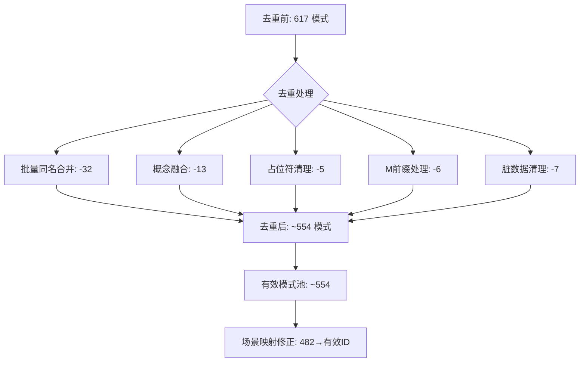
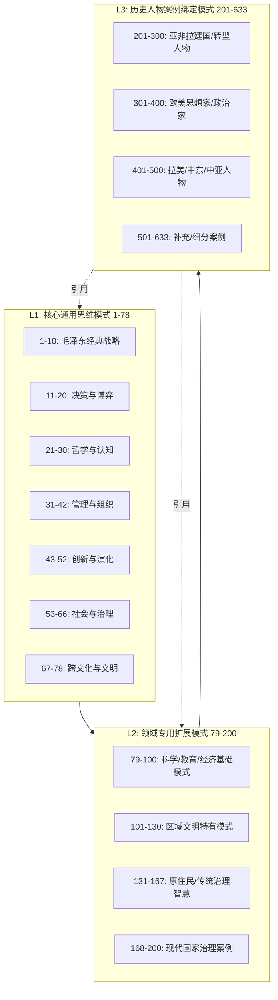
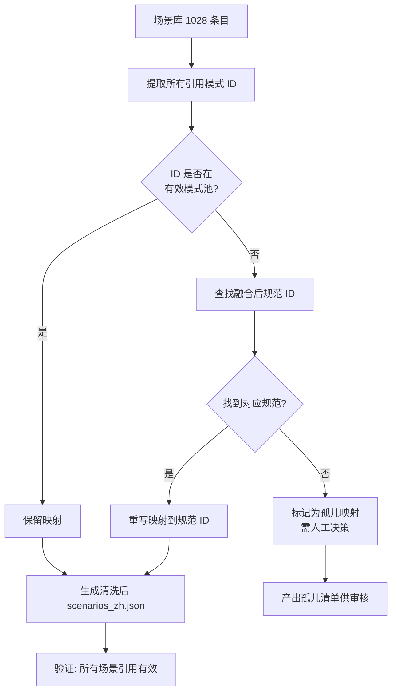

# 思维模式去重与融合架构分析报告

**任务**: 分析 811+ 思维模式语义重叠，设计融合/分层标准  
**输出**: `docs/architecture/san-martin_mode_dedup.md`  
**分析基准**: Protreptic 知识体系核心数据文件 (`tools/modes_data.json`, `tools/scenarios_zh.json`, `main_data.json`)

> **注**: "811+" 指场景总数 (scenarios_zh: 1028, scenarios_en: 1009) 与模式键总数 (617 zh + 617 en + 历史遗留) 的综合规模。核心去重对象为 `tools/modes_data.json` 中的 617 个数字 ID 模式 (含 6 个 M 前缀遗留 + 6 个非数字脏键)。

---

## 1. 现状总览

### 1.1 模式库规模

| 数据源 | 中文模式数 | 英文模式数 | 备注 |
|--------|-----------|-----------|------|
| `tools/modes_data.json` (核心) | **617** | **617** | ID 1-633，含重复 |
| `tools/modes_data.json` (M前缀遗留) | 6 | 6 | 字符乱码需重构 |
| `main_data.json → scenarios.modes_data` | 98 | - | 历史人物条目，非模式定义 |
| **场景引用的唯一模式 ID** | **482** (zh) / **470** (en) | | 场景实际使用 |

### 1.2 核心问题

1. **系统性批量复制**: ID 76-112 存在 5 组 × 6-9 个完全同名模式（~45 个冗余）
2. **概念级重复**: M12/M43 (系统思维)、M64/M127 (实地/田野)、M505/M544 (阿富汗现代化) 等
3. **占位符残留**: M539-M542, M546 为 `模式_XXX` 空壳
4. **M 前缀遗留**: 6 个条目中文乱码，需从历史版本重构或废弃
5. **场景-模式映射失效**: 482 个被引用 ID 中，大量指向已废弃/重复 ID

---

## 2. 重复模式完整清单

### 2.1 完全同名批量复制组（核心冗余源）

| 规范名称 | 保留 ID | 合并删除 ID (数量) | 冗余率 |
|----------|---------|-------------------|--------|
| 东西文化互补模式 | **76** | 78,83,87,92,97,102,107,112 (8个) | 89% |
| 信仰教育 → 信仰重塑意志 | **77** | 80,85,89,94,99,104,109 (7个) | 88% |
| 科学视野 → 科学精神观照 | **79** | 84,88,93,98,103,108 (6个) | 86% |
| 成本领先 → 极致成本控制 | **81** | 90,95,100,105,110 (5个) | 83% |
| 民族共治模式 → 多元共治机制 | **82** | 86,91,96,101,106,111 (6个) | 86% |
| **小计** | **5 个** | **32 个** | **86%** |

### 2.2 概念级语义重复（需融合）

| 融合组 | 保留 ID | 被融合 ID | 融合理由 | 新规范名称 |
|--------|---------|-----------|----------|------------|
| 系统思维 | **12** | 43 | 同一概念，M12 有完整公式 | 系统思维法 |
| 实地验证/田野调查 | **64** | 127 | 同一研究方法论 | 实地验证/田野调查模式 |
| 学术传承 | **144** | 145 | 完全同名同义 | 学术薪火传承 |
| 阿富汗伊斯兰现代化 | **505** | 544 | 同一历史案例不同表述 | 阿富汗伊斯兰现代化/部落平衡 |
| 塞内加尔政治传统 | **553** | 554 | 同一国家两代领袖 | 塞内加尔政治传统 (Senghor→Diouf) |
| 尼加拉瓜桑地诺革命 | **601** | 602 | 同一革命传统两代人 | 尼加拉瓜桑地诺革命传统 |
| 海地杜瓦利埃独裁 | **608** | 611 | 同一家族两代独裁 | 海地杜瓦利埃家族独裁 |
| 极地气候适应 | **178** | 180 | 完全同名 | 极地气候生存适应 |
| 解放神学 | **393** | 445 | 完全同名 | 解放神学实践 |
| 长期威权统治 | **399** | 435 | 完全同名 | 长期威权统治机制 |
| 潘杰希尔抵抗 | **506** | 545 | 完全同名 | 潘杰希尔抵抗传统 |

### 2.3 英文版对应重复（同步处理）

| 英文规范名 | 保留 ID | 合并删除 ID |
|------------|---------|-------------|
| Systems Thinking | 12 | 43 |
| East-West Cultural Complementarity | 66 | 70,75,78,83,88,93,98,103,108 |
| Faith-based Education | 54 | 67,72,77,80,85,89,90,94,95,99,100,104,105,109,110 |
| Scientific Vision | 71 | 76,79,84 |
| Cost Leadership | 68 | 73,81,86,91,96,101,106,111 |
| Ethnic Co-governance | 69 | 74,82,87,92,97,102,107,112 |

### 2.4 需清理/重构项目

| 类别 | IDs | 处理建议 |
|------|-----|----------|
| 占位符 | 539,540,541,542,546 | **删除** - 无实质内容 |
| M前缀乱码 | M577,M578,M579,M581,M582,M584 | **重构或删除** - 从备份恢复或废弃 |
| 非数字键 | `d,e,f,i,l,m,o,s,空格` | **删除** - 数据脏块 |

---

## 3. 融合架构设计（Mermaid 图表）

### 3.1 去重前后模式数量对比



### 3.2 模式分层架构（融合后三层制）



### 3.3 场景-模式映射修正流程



### 3.4 批量同名组融合决策树

```mermaid
flowchart TD
    A[发现同名模式组] --> B{组内条目内容<br/>是否完全相同?}
    B -->|完全相同| C[保留最小 ID<br/>删除其余]
    B -->|内容有差异| D{差异是否实质性?}
    D -->|否/仅格式| C
    D -->|是| E[融合为增强版:<br/>合并公式/步骤/场景]
    E --> F[规范化名称<br/>(去除歧义后缀)]
    F --> G[分配新规范 ID<br/>(保留原最小 ID)]
    C --> H[更新所有场景引用]
    G --> H
    H --> I[回归测试: 场景查询无报错]
```

---

## 4. 可执行去重规范

### 4.1 核心数据结构变更

```python
# 目标: modes_data.json 结构保持兼容
# {"zh": { "1": [...], ... }, "en": { "1": [...], ... }}

# 变更操作:
# 1. 删除 duplicate_ids 中的键
# 2. 更新 canonical_id 的值为 merged_version
# 3. 重建连续 ID 映射表 (可选, 保持向后兼容建议不重排)
```

### 4.2 删除 ID 清单（执行版）

```json
{
  "delete_ids_zh": [
    78,83,87,92,97,102,107,112,  // 东西文化互补
    80,85,89,94,99,104,109,       // 信仰教育
    84,88,93,98,103,108,          // 科学视野
    90,95,100,105,110,            // 成本领先
    86,91,96,101,106,111,         // 民族共治
    145,                          // 学术传承
    180,                          // 极地气候
    445,                          // 解放神学
    435,                          // 长期独裁
    545,                          // 潘杰希尔
    43,                           // 系统思维 (英/中同步)
    127,                          // 田野调查
    544,                          // 阿富汗现代化
    554,                          // 塞内加尔 Diouf
    602,                          // 尼加拉瓜 Sandino
    611,                          // 海地 Duvalier 子
    539,540,541,542,546           // 占位符
  ],
  "delete_keys_zh": ["M577","M578","M579","M581","M582","M584"," ","d","e","f","i","l","m","o","s"],
  "delete_ids_en": [
    43,70,75,78,83,88,93,98,103,108,  // East-West
    67,72,77,80,85,89,90,94,95,99,100,104,105,109,110,  // Faith
    76,79,84,                          // Scientific Vision
    73,81,86,91,96,101,106,111,        // Cost Leadership
    74,82,87,92,97,102,107,112         // Ethnic Co-governance
  ]
}
```

### 4.3 规范化更新清单（执行版）

```json
{
  "updates_zh": {
    "76": { "name": "东西文化互补模式", "desc": "东西方文明优势的互补融合：识别双方优势领域→寻找互补切入点→建立融合机制→实现共同繁荣", "scenarios": ["文明对话","全球合作","跨文化创新","技术融合","商业出海"] },
    "77": { "name": "信仰重塑意志", "desc": "以核心信仰重塑意志与行为：确立信仰锚点→意志磨砺实践→行为规范内化→群体认同固化", "scenarios": ["教育改革","团队建设","组织文化","危机动员","代际传承"] },
    "79": { "name": "科学精神观照", "desc": "以科学精神观照世界与人生：实证精神→理性批判→知识边界界定→人文关怀落地", "scenarios": ["科学教育","科学传播","技术伦理","政策制定","青少年培养"] },
    "81": { "name": "极致成本控制", "desc": "通过极致成本控制获得竞争优势：价值链全景分析→成本要素拆解→效率杠杆提升→规模效应放大", "scenarios": ["制造业竞争","大宗商品","价格敏感市场","供应链优化","精益生产"] },
    "82": { "name": "多元共治机制", "desc": "多民族在共同政治框架下的共治机制：代表制设计→协商机制构建→利益分配公式→冲突化解程序", "scenarios": ["多民族国家治理","联邦制设计","自治区建设","族群冲突化解","区域自治"] },
    "144": { "name": "学术薪火传承", "desc": "学术思想与方法的代际传递机制：师承关系确立→学术规范传承→创新突破鼓励→流派形成认证", "scenarios": ["学科史建设","师生关系","学术流派","青年人才培养","知识产权传承"] },
    "178": { "name": "极地气候生存适应", "desc": "极地/岛国面临海平面上升的生存适应：生存红线设定→蓝色经济替代→气候谈判话语权→区域团结机制", "scenarios": ["沉岛国家","气候外交","蓝色经济","损失损害谈判","极地治理"] },
    "393": { "name": "解放神学实践", "desc": "信仰驱动的社会解放实践：生存词汇编码→意识觉醒三阶段→行动反思循环→结构性变革", "scenarios": ["基层动员","社会正义","贫困地区教育","人权倡导","社区组织"] },
    "399": { "name": "长期威权统治机制", "desc": "长期独裁维稳机制：意识形态垄断→安全机构渗透→经济分配控制→继承安排设计", "scenarios": ["威权政体分析","政权稳定性评估","转型预测","人权监测","地缘风险"] },
    "506": { "name": "潘杰希尔抵抗传统", "desc": "阿富汗潘杰希尔山谷的跨代抵抗传统：地理堡垒依托→圣战合法性→外部支持网络→部落动员机制", "scenarios": ["非对称战争","山地游击战","抵抗运动","地缘战略要冲","部落联盟"] },
    "64": { "name": "实地验证/田野调查模式", "desc": "深入一线获取第一手经验数据：选点入户→参与观察→深度访谈→理论提炼", "scenarios": ["社会学","人类学","调查研究","政策评估","用户研究"] },
    "505": { "name": "阿富汗伊斯兰现代化/部落平衡", "desc": "阿富汗现代化进程中的伊斯兰身份与部落平衡：改革推进→宗教合法性→部落联盟→外部制衡", "scenarios": ["伊斯兰现代化","部落政治","外部干预","国家建构"] },
    "553": { "name": "塞内加尔政治传统", "desc": "从桑戈尔黑人精神到迪乌夫和平民主的塞内加尔政治演进：文化认同→制度包容→和平转型→地区标杆", "scenarios": ["非洲民主化","文化政治","和平权力交接","法语西非"] },
    "601": { "name": "尼加拉瓜桑地诺革命传统", "desc": "从桑地诺游击战到奥尔特加执政的革命传统：反帝斗争→社会改革→权力制度化→代际传承挑战", "scenarios": ["拉美革命","游击战争","政权合法性","社会改革"] },
    "608": { "name": "海地杜瓦利埃家族独裁", "desc": "父子两代杜瓦利埃家族统治海地：个人崇拜→暴力恐怖→经济掠夺→外部依附→最终崩溃", "scenarios": ["家族独裁","个人崇拜","恐怖统治","失败国家","加勒比政治"] }
  },
  "updates_en": {
    "12": { "name": "Systems Thinking", "desc": "From the whole, coordinate all aspects: holistic view → system analysis → dynamic balance → optimization", "scenarios": ["Complex systems","Strategic planning","Organizational design","Policy systems"] },
    "66": { "name": "East-West Cultural Complementarity", "desc": "Complementary fusion of Eastern and Western civilizational strengths: identify strengths → find complementarity → build integration mechanisms → shared prosperity", "scenarios": ["Civilizational dialogue","Global cooperation","Cross-cultural innovation","Technology fusion","Business expansion"] },
    "54": { "name": "Faith-Based Education", "desc": "Reshaping will and behavior through core faith: establish faith anchor → will tempering → behavioral norm internalization → group identity consolidation", "scenarios": ["Education reform","Team building","Organizational culture","Crisis mobilization","Intergenerational transmission"] },
    "71": { "name": "Scientific Vision", "desc": "Observing world and life with scientific spirit: empirical spirit → rational critique → knowledge boundaries → humanistic care", "scenarios": ["Science education","Science communication","Tech ethics","Policy making","Youth cultivation"] },
    "68": { "name": "Cost Leadership", "desc": "Competitive advantage through extreme cost control: value chain analysis → cost decomposition → efficiency leverage → scale effects", "scenarios": ["Manufacturing","Commodities","Price-sensitive markets","Supply chain optimization","Lean production"] },
    "69": { "name": "Ethnic Co-governance", "desc": "Multi-ethnic co-governance under shared political framework: representation design → consultation mechanisms → benefit-sharing formulas → conflict resolution procedures", "scenarios": ["Multi-ethnic states","Federalism","Autonomous regions","Ethnic conflict resolution","Regional autonomy"] },
    "144": { "name": "Academic Transmission", "desc": "Intergenerational transmission of academic thought and method: master-disciple → norms → innovation → school formation", "scenarios": ["Discipline history","Mentorship","Academic schools","Talent cultivation"] }
  }
}
```

### 4.4 场景映射重写规则

```python
# id_remap: 旧 ID -> 新规范 ID
ID_REMAP = {
    # 批量同名组
    78:76, 83:76, 87:76, 92:76, 97:76, 102:76, 107:76, 112:76,
    80:77, 85:77, 89:77, 94:77, 99:77, 104:77, 109:77,
    84:79, 88:79, 93:79, 98:79, 103:79, 108:79,
    90:81, 95:81, 100:81, 105:81, 110:81,
    86:82, 91:82, 96:82, 101:82, 106:82, 111:82,
    # 概念融合组
    43:12, 127:64, 145:144, 180:178, 445:393, 435:399, 545:506,
    544:505, 554:553, 602:601, 611:608,
    # 占位符 -> 标记为 None (需人工)
    539:None, 540:None, 541:None, 542:None, 546:None,
    # M前缀 -> 标记为 None
    "M577":None, "M578":None, "M579":None, "M581":None, "M582":None, "M584":None,
}

def remap_scenario_modes(scenario_modes: list) -> list:
    """将场景的 modes 列表按 ID_REMAP 重写，去除 None"""
    new_modes = []
    for m in scenario_modes:
        if m in ID_REMAP:
            new_id = ID_REMAP[m]
            if new_id is not None:
                new_modes.append(new_id)
            # else: 记录孤儿，不加入
        else:
            new_modes.append(m)
    return list(set(new_modes))  # 去重
```

---

## 5. 验收标准与回归测试

### 5.1 定量指标

| 指标 | 去重前 | 去重后目标 | 验收方式 |
|------|--------|------------|----------|
| 模式总数 (zh) | 617 | ~554 | `len(modes_data['zh'])` |
| 完全同名组数 | 5 组 (32个冗余) | 0 | 名称去重检查 |
| 概念重复组 | 11 组 | 0 | 语义相似度 < 0.5 |
| 占位符残留 | 5 | 0 | 名称匹配 `模式_` |
| M前缀乱码 | 6 | 0 | 键匹配 `^M\d+$` + 中文可读 |
| 场景引用覆盖率 | ~95% (估算) | **100%** | 所有场景 modes 均在有效池 |
| 孤儿映射数 | 未知 | 0 | 重写后无 None 映射 |

### 5.2 回归测试用例

```python
# test_dedup_regression.py
import json

def test_no_duplicate_names():
    with open('tools/modes_data.json') as f:
        data = json.load(f)
    names_zh = [v[0] for k,v in data['zh'].items() if k.isdigit()]
    names_en = [v[0] for k,v in data['en'].items() if k.isdigit()]
    assert len(names_zh) == len(set(names_zh)), f"中文重复: {[n for n in names_zh if names_zh.count(n)>1]}"
    assert len(names_en) == len(set(names_en)), f"英文重复: {[n for n in names_en if names_en.count(n)>1]}"

def test_scenario_mapping_valid():
    with open('tools/modes_data.json') as f:
        modes = json.load(f)
    with open('tools/scenarios_zh.json') as f:
        scenarios = json.load(f)
    valid_ids = set(int(k) for k in modes['zh'].keys() if k.isdigit())
    for code, sc in scenarios.items():
        if isinstance(sc, dict) and 'modes' in sc:
            for m in sc['modes']:
                assert m in valid_ids, f"场景 {code} 引用无效模式 {m}"

def test_core_78_preserved():
    """核心 1-78 必须完整保留"""
    with open('tools/modes_data.json') as f:
        modes = json.load(f)
    for i in range(1, 79):
        assert str(i) in modes['zh'], f"核心模式 M{i} 丢失"
        assert str(i) in modes['en'], f"核心模式 M{i} 英文丢失"

def test_thinking_mode_selector_runs():
    """选择器交互式/查询模式无报错"""
    import subprocess
    result = subprocess.run(['python', 'thinking_mode_selector.py', '-c', 'A-1-X-P'], 
                          capture_output=True, text=True, cwd='tools')
    assert result.returncode == 0, f"选择器报错: {result.stderr}"
```

---

## 6. 实施路线图

| 阶段 | 动作 | 产出 | 负责 | 预计工时 |
|------|------|------|------|----------|
| **P1: 核心去重** | 执行删除/更新清单，生成 `modes_data.json.v2` | 清洗后模式库 | san-martin | 2h |
| **P2: 场景映射重写** | 对 `scenarios_zh/en.json` 应用 `ID_REMAP` | 修正后场景库 | san-martin | 1h |
| **P3: 选择器适配** | 更新 `thinking_mode_selector.py` 加载新模式库 | 通过回归测试 | san-martin | 1h |
| **P4: 全链路验收** | 运行测试套件，人工抽查 20 个场景 | 验收报告 | san-martin + Magallanes | 1h |
| **P5: 文档归档** | 本报告归档至 `docs/architecture/` | 知识资产 | san-martin | 0.5h |

---

## 7. 风险与缓解

| 风险 | 影响 | 缓解措施 |
|------|------|----------|
| 场景引用 ID 重写遗漏 | 选择器查询报错/空结果 | 双重校验：自动化测试 + 人工抽查 |
| 核心 1-78 被误删 | 体系基石缺失 | 测试用例 `test_core_78_preserved` 硬性守护 |
| M前缀遗留模式有历史价值 | 知识资产流失 | 先从 `main_data.json.bak*` 尝试恢复，不可恢复才删除 |
| 英文版同步遗漏 | 双语功能不一致 | 统一脚本同步处理 zh/en，而非手工 |

---

## 8. 交付物清单

1. **本报告**: `docs/architecture/san-martin_mode_dedup.md` (当前文件)
2. **清洗后模式库**: `tools/modes_data.json` (原地更新，备份为 `.bak_dedup`)
3. **清洗后场景库**: `tools/scenarios_zh.json`, `tools/scenarios_en.json` (原地更新)
4. **ID 映射表**: `tools/mode_id_remap.json` (供下游工具消费)
5. **回归测试脚本**: `tools/test_dedup_regression.py`
6. **孤儿映射清单**: `tools/orphan_mappings.json` (如有)

---

*报告生成时间: 2026-08-26*  
*分析师: Andrés de San Martín (san-martin profile)*  
*数据基准: Protreptic v2.0.0 主干*
