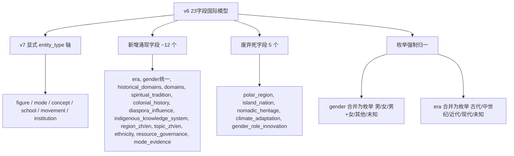
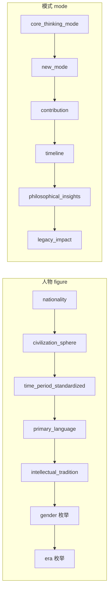
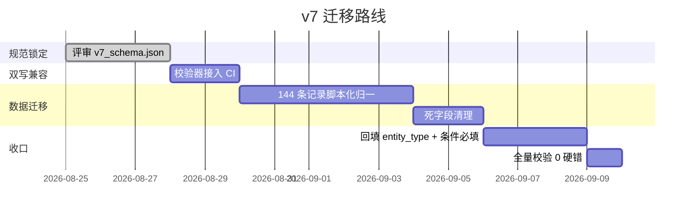

# v6 Schema 演进规划：23 字段拓展需求评估与 v7 草案

作者：san-martin（架构分析交付）
日期：2026-08-25
基线：`tools/international_schema_v6.md`（23 字段国际模型，Phase 13-16）
产出：`docs/architecture/v7_schema.json`（可执行 JSON Schema）+ `docs/architecture/v7_validate.py`（针对 144 条语料的实证校验器）

---

## 0. 结论摘要（TL;DR）

v6 的「23 字段拓展」是按 Phase 逐批累加的结果，并非一次有意为之的统一模型。在对真实语料（144 条人物/模式记录）做实证审计后，发现三个结构性问题，构成本次演进的核心需求：

1. **方言分裂**：活数据已裂成三种互斥方言（国际 / 中文人物 / 土著-深度），v6 只覆盖第一种。
2. **死字段**：v6 的 23 个拓展字段中，**4 个在全语料（144/144）从未被填充**（polar_region / island_nation / nomadic_heritage / climate_adaptation），另有 1 个仅 3 条使用。
3. **枚举污染**：同一语义被多种写法污染（gender = `男`/`Male`/`男/女`；legacy_type = `政治`/`political`；regional_integration = `美洲`/`南亚`/`喜马拉雅`）。

**v7 定位**：以 v6 为底座，新增 `entity_type` 显式类型轴，把实证涌现的 ~23 个字段（era / gender 统一 / historical_domains / domains / spiritual_tradition / colonial_history / indigenous_knowledge_system 等）纳入可选字段，强制枚举归一，废弃 5 个死字段。校验器实测：当前 144 条记录全部存在硬错（748 处），迁移工程明确且可量化。

---

## 1. 任务边界与权衡

- **本次交付范围**：需求评估 + v7 草案（可执行规范 + 校验器）。**不**直接改 144 条数据文件。
- **不枚举"23 个拓展需求"为 23 个独立新字段**：审计显示那 23 个 v6 字段里有 5 个应废弃，另需新增 ~12 个真实涌现字段。强行凑 23 是新瓶装旧酒。
- **向后兼容优先**：v7 保留 v6 全部仍在用的字段，仅废弃死字段并把性别语义合并，避免破坏现有校验管线。

---

## 2. 实证审计证据（来自 v7_validate.py 对 144 条记录的运行）

### 2.1 方言分布（按文件字段指纹聚类）

| 方言 | 记录数 | 代表字段 |
|------|-------|---------|
| 中文人物（chinese） | 39 | era, historical_domains, domains, ethnicity, gender |
| 国际 v6（intl_v6） | 32 | cross_cultural_impact, legacy_type, legal_system, regional_integration |
| 土著-深度（indigenous） | 22 | region_zh/en, topic_zh/en, core_thinking_mode, new_mode, indigenous_knowledge_system |
| 混合（chinese+indigenous+intl_v6） | 43 | 跨三套，最危险 |
| 其他 | 1 | AT-FRU-001（schema 外结构） |

→ 约 **1/3 记录使用了 v6 完全未定义的字段**，1/3 记录混合了多套字段，**方言不兼容是真实风险**。

### 2.2 v6 死字段（全 144 条从未填充）

```
polar_region                0/144
island_nation               0/144
nomadic_heritage            0/144
climate_adaptation          0/144
resource_curse_mitigation   3/144   (仅 2.1%)
```

→ 这 5 个字段占 v6 拓展字段的 22%，实际贡献为 0。v7 建议：废弃 4 个，将 `resource_curse_mitigation` 泛化为 `resource_governance`（布尔/串）。

### 2.3 枚举污染（必须归一才能进 v7）

| 字段 | 污染写法 | 数量 |
|------|---------|------|
| regional_integration | `美洲` / `南亚` / `喜马拉雅` / `东非共同体` / `南部非洲发展共同体/东非共同体` | 14+4+2+1+1 |
| digital_adaptation | `发展中` / `成熟` / `先进`（应为 先驱/跟随/滞后/跳跃） | 7+4+4 |
| gender | `Male`（与 `男` 并存） | 3 |
| legacy_type | `政治`（与 `political` 并存） | 3 |
| education_tradition | `南亚`（不在 v6 枚举） | 2 |
| era | `1910-1999` / `1941-至今` / …（自由串） | 6 |
| conflict_resolution_mechanism | `民主改革/议会民主/媒体自由`（自由串） | 2 |

→ v7 对所有枚举字段强制归一；自由文本类字段（region/topic/source_refs）暂不枚举，保留字符串。

### 2.4 校验器硬错统计

```
CORPUS RECORDS VALIDATED: 144
HARD ERRORS (missing required/pattern): 748
records with >=1 hard error: 144  (100%)
  [figure] 缺 gender: 78
  [figure] 缺 era:    78
  [figure] 缺 identity 字段(nationality 等): 24
  [mode]   缺 core_thinking_mode/new_mode/contribution/...: 28
```

逻辑：当前数据无 `entity_type`，校验器按 code 前缀推断（人物 / 模式），暴露出 78 条人物缺统一身份轴、28 条模式缺深度字段。**这正是 v7 新增字段要兜住的部分**。

---

## 3. v7 草案设计

### 3.1 核心变更（相对 v6）



### 3.2 字段总数对比

| 类别 | v6 | v7 |
|------|----|----|
| 核心必填 | 15 | 16（新增 `entity_type`、`core_mode` 提升为必填） |
| 国际化核心 | 8 | 8（保留） |
| 可选/涌现 | 16 | ~27（新增 12，废弃 5 中的 1 泛化） |
| 条件必填（按 entity_type） | 无 | 有（人物/模式差异化） |

### 3.3 条件必填（解决方言分裂的关键）



→ 同一文件不再因"不知道这是人物还是模式"而乱填；校验器按 `entity_type` 走不同分支。

### 3.4 枚举归一映射（节选）

| 语义 | v6 / 现状 | v7 枚举 |
|------|----------|---------|
| 性别 | `男`/`Male`/`男/女` + `gender_role_innovation` | `男`/`女`/`男+女`/`其他`/`未知`；创新描述移入 `gender_role_note` |
| 时期 | `现代`/`1910-1999`/`1941-至今` | `古代`/`中世纪`/`近代`/`现代`/`未知` |
| 区域一体化 | `EU`/`美洲`/`南亚`/`喜马拉雅` | 保留 v6 枚举 + `无`/`未知` |
| 遗产类型 | `cultural`/`政治`/`political` | `cultural`/`political`/`scientific`/`artistic`/`military`/`economic`/`spiritual`/`unknown` |

完整定义在 `docs/architecture/v7_schema.json`（可执行，校验器直接读取）。

---

## 4. 迁移路线（建议，非本次执行）



**关键决策点（需 Magallanes 拍板）**：
- D1：v7 是否强制 `entity_type`？→ 强烈建议，否则方言分裂无法根治。
- D2：死字段直接删除还是保留读取兼容 1 个版本？→ 建议保留读取兼容、写入禁用。
- D3：自由文本字段（region/topic/source_refs）是否进枚举？→ 建议暂缓，先字符串后治理。

---

## 5. 可执行产物

- `docs/architecture/v7_schema.json` — v7 草案 JSON Schema（草案标记，权威来源）
- `docs/architecture/v7_validate.py` — 针对 144 条语料的校验器，**已实跑**：144 条全有硬错 / 748 处，证据见 §2.4

---

## 6. 阻碍与待确认（kanban 标注）

- 无外部阻塞。v7 草案为**架构建议**，落地需 Magallanes 对 §4 三个决策点拍板。
- 建议后续子卡：由数据迁移工程师执行 §4 迁移路线（脚本化归一 144 条 + 接入 CI）。
